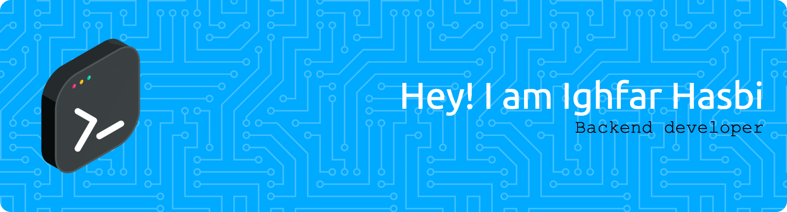

<h2 align="center"></h2>

###

<h4 align="left">Skills</h4>

###

  
  
  
  
  
  
  
  
  

###

<h4 align="left">About Me</h4>

###

🔭 I’m working as a Software Engineer — explored different roles from backend (Rust & Go), to Quality Assurance.  📚 I’m currently diving deeper into Go at Sinau Koding Bootcamp, building RESTful APIs with Echo, PostgreSQL, Redis, all wrapped in Docker.  ⚡ In my free time, I love tinkering with backend stuff 💻 and brewing coffee ☕️ as a barista hobby.

###

<h4 align="left">Socials</h4>

###

###

<h2 align="left"></h2>

###

<picture>
  <source media="(prefers-color-scheme: dark)" srcset="https://raw.githubusercontent.com/ighfarhasbi/ighfarhasbi/output/pacman-contribution-graph-dark.svg">
  <source media="(prefers-color-scheme: light)" srcset="https://raw.githubusercontent.com/ighfarhasbi/ighfarhasbi/output/pacman-contribution-graph.svg">
  
</picture>

###
